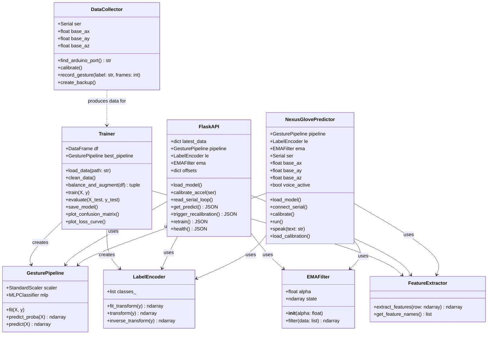
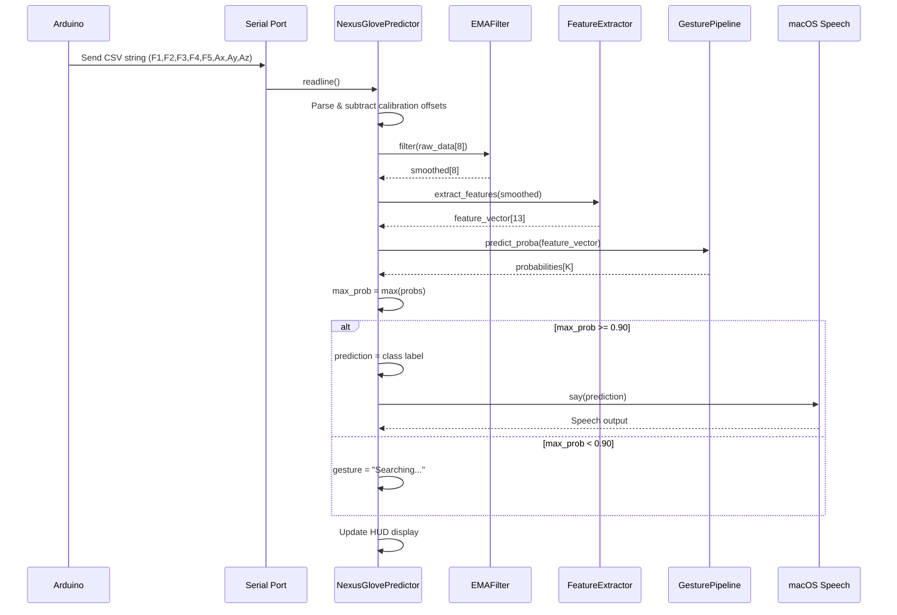
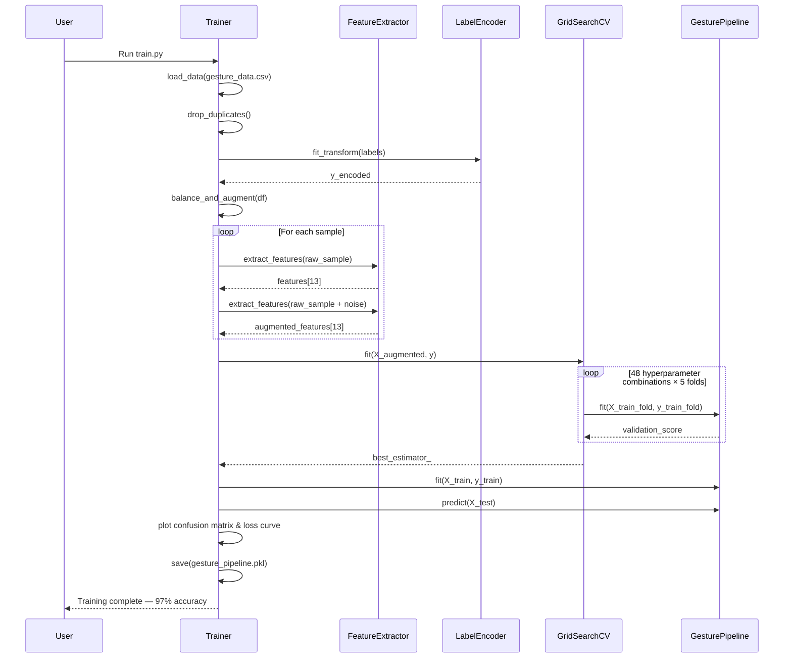
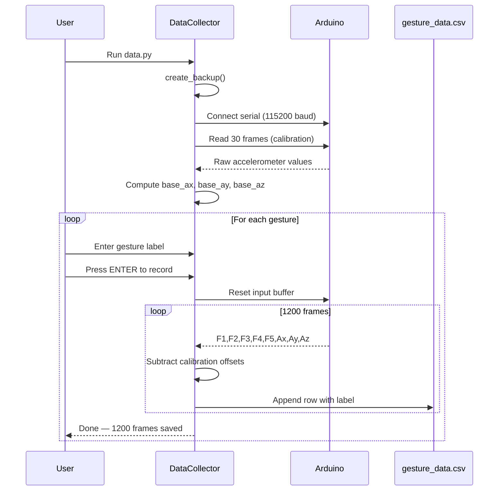
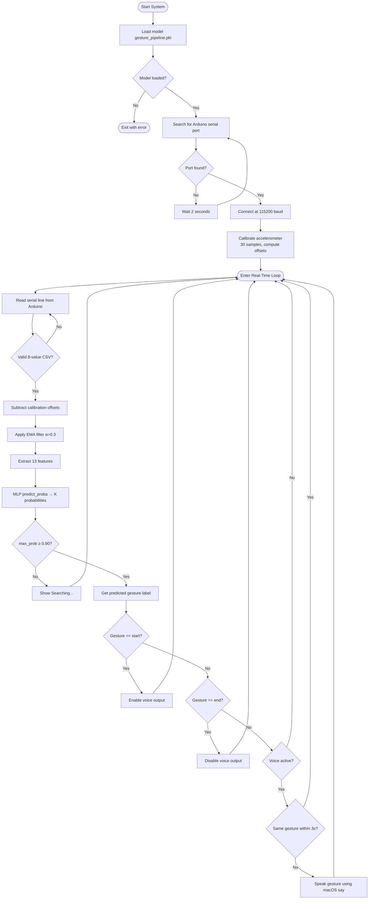
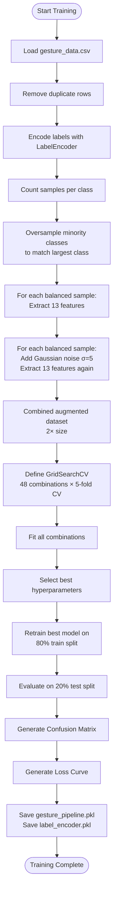
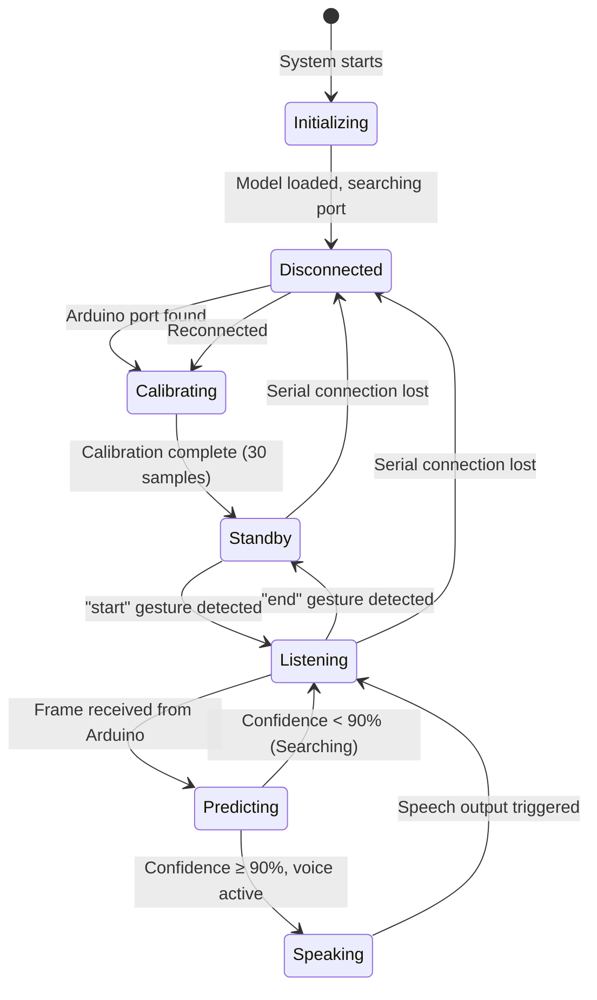
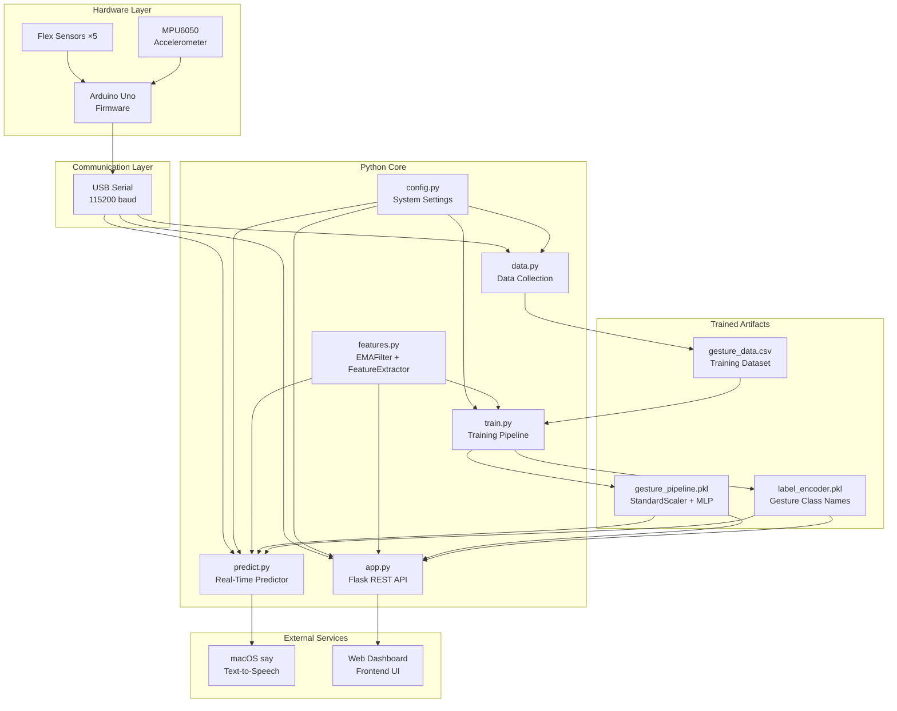
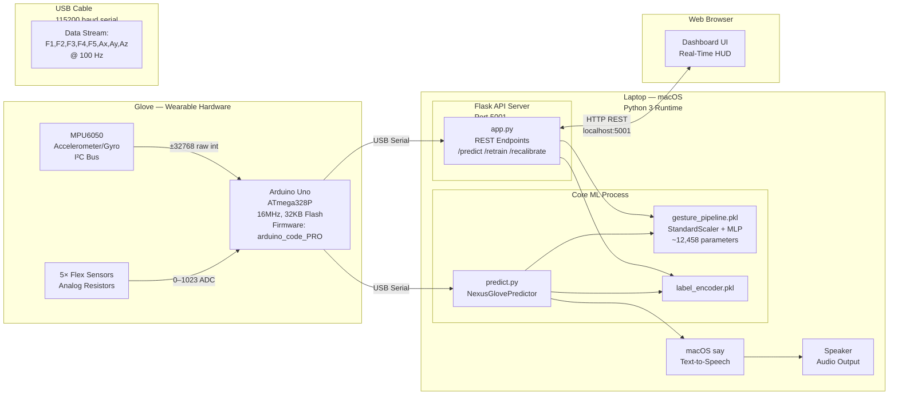

# Chapter 4: System Design

## 4.1. Design — Object-Oriented Approach

The system follows an Object-Oriented design approach. The key classes identified during analysis are refined below with full relationships, responsibilities, and interactions.

---

### 4.1.1. Refinement of Class Diagram

The class diagram below shows all major classes, their attributes, methods, and relationships in the final system.



---

### 4.1.2. Refinement of Sequence Diagrams

#### Sequence Diagram 1: Real-Time Gesture Prediction

This diagram shows the interaction flow from the moment the Arduino sends sensor data to the system speaking the predicted word.



#### Sequence Diagram 2: Model Training Pipeline



#### Sequence Diagram 3: Data Collection



---

### 4.1.3. Refinement of Activity Diagram

#### Activity Diagram 1: System Startup & Real-Time Operation



#### Activity Diagram 2: Training Pipeline



#### Activity Diagram 3: State Diagram — System States



---

### 4.1.4. Component Diagram

The component diagram shows how the major software and hardware modules are organized and how they depend on each other.



---

### 4.1.5. Deployment Diagram

The deployment diagram shows the physical architecture of how the system is deployed across hardware nodes.



---

## 4.2. Algorithm Details

### 4.2.1. Accelerometer Calibration Algorithm

**Purpose:** Remove the gravitational baseline from accelerometer readings so values represent relative hand motion.

**Source:** `data.py`, `predict.py`, `app.py`

**Mathematical Formula:**
```
base_ax = (1/N) × Σᵢ axᵢ      where N = 30
base_ay = (1/N) × Σᵢ ayᵢ
base_az = (1/N) × Σᵢ azᵢ

At runtime:
ax_cal = ax_raw − base_ax
ay_cal = ay_raw − base_ay
az_cal = az_raw − base_az
```

**Pseudocode:**
```
FUNCTION calibrate(serial, N=30):
    sum_ax = sum_ay = sum_az = 0
    count = 0
    WHILE count < N:
        line = READ(serial)
        vals = PARSE(line)  // [f1..f5, ax, ay, az]
        sum_ax += vals[5];  sum_ay += vals[6];  sum_az += vals[7]
        count += 1
    RETURN (sum_ax/N, sum_ay/N, sum_az/N)
```

---

### 4.2.2. Exponential Moving Average (EMA) Filter

**Purpose:** Smooth noisy real-time sensor data to reduce electrical jitter.

**Source:** `features.py` — `EMAFilter` class

**Formula:**
```
S(t) = α × X(t) + (1 − α) × S(t−1)
```
- α = **0.3** (smoothing factor)
- Low α → heavier smoothing, more lag
- High α → less smoothing, more responsive

**Pseudocode:**
```
CLASS EMAFilter(alpha=0.3):
    state = NULL
    FUNCTION filter(data[8]):
        IF state IS NULL:
            state = data
        ELSE:
            state = alpha × data + (1 − alpha) × state
        RETURN state
```

---

### 4.2.3. Feature Engineering Algorithm

**Purpose:** Transform 8 raw sensor values into 13 semantically meaningful features.

**Source:** `features.py` — `extract_features()`

| Feature | Formula | Meaning |
|---|---|---|
| Flex1–Flex5 | Raw values | Individual finger bend |
| AccX, AccY, AccZ | Calibrated raw | Hand acceleration |
| **Pitch** | `atan2(ay, √(ax²+az²)) × 180/π` | Forward/backward tilt (°) |
| **Roll** | `atan2(−ax, az) × 180/π` | Left/right tilt (°) |
| **AccMag** | `√(ax²+ay²+az²)` | Overall motion intensity |
| **FlexAvg** | `mean(F1..F5)` | Overall grip tightness |
| **FlexRange** | `max(F1..F5) − min(F1..F5)` | Finger spread |

**Pseudocode:**
```
FUNCTION extract_features(raw[8]):
    flex = raw[0:5]
    ax, ay, az = raw[5], raw[6], raw[7]

    pitch     = atan2(ay, sqrt(ax²+az²)) × (180/π)
    roll      = atan2(-ax, az) × (180/π)
    accel_mag = sqrt(ax²+ay²+az²)
    flex_avg  = mean(flex)
    flex_range= max(flex) - min(flex)

    RETURN [raw[0..7], pitch, roll, accel_mag, flex_avg, flex_range]
    // Output: 13-dimensional feature vector
```

---

### 4.2.4. Data Balancing & Augmentation Algorithm

**Purpose:** Ensure equal class representation and improve neural network generalisation.

**Source:** `train.py` — `balance_and_augment()`

**Steps:**
1. Find class with maximum samples (`target_count`)
2. Oversample each minority class by resampling with replacement until `target_count` is reached
3. For every sample, create one augmented copy by adding Gaussian noise

**Pseudocode:**
```
FUNCTION balance_and_augment(dataset):
    target = max(count per class)

    FOR EACH class IN dataset:
        IF count(class) < target:
            class_data = RESAMPLE(class, n=target, replace=True)
        balanced_set.append(class_data)

    FOR EACH (sample, label) IN balanced_set:
        X_out.append(extract_features(sample))          // original
        noise = Normal(mean=0, std=5, size=8)
        X_out.append(extract_features(sample + noise))  // augmented
        y_out.append(label) × 2

    RETURN X_out, y_out   // 2× dataset size, all classes equal
```

---

### 4.2.5. MLP Neural Network Training with Hyperparameter Optimisation

**Purpose:** Train the gesture classifier and automatically find the optimal architecture.

**Source:** `train.py`

**Pipeline:**
```
13-D Feature Vector → StandardScaler → MLPClassifier → Gesture Class
```

**StandardScaler (Z-Score Normalisation):**
```
X_scaled = (X − μ) / σ
```
Ensures all 13 features contribute equally regardless of their raw scale.

**MLP Architecture:**

| Layer | Neurons | Activation |
|---|---|---|
| Input | 13 | — |
| Hidden 1 | 128 | ReLU |
| Hidden 2 | 64 | ReLU |
| Hidden 3 | 32 | ReLU |
| Output | K (gestures) | Softmax |
| **Total params** | **~12,458** | — |

**Single Neuron Computation:**
```
z = Σ(wᵢ × xᵢ) + bias
output = ReLU(z) = max(0, z)
```

**Loss Function (Cross-Entropy):**
```
L = −(1/N) × ΣᵢΣⱼ yᵢⱼ × log(ŷᵢⱼ)
```

**Weight Update (Adam Optimiser):**
```
w_new = w_old − η × (∂L/∂w)
```

**GridSearchCV Hyperparameter Space:**

| Parameter | Values Searched |
|---|---|
| Hidden layers | (128,64,32), (64,64,64), (100,50) |
| Activation | relu, tanh |
| Alpha (L2) | 0.0001, 0.001, 0.01, 0.1 |
| Learning rate | 0.001, 0.005 |
| **Total combos** | **48** |
| **CV folds** | **5 (Stratified K-Fold)** |

**Pseudocode:**
```
FUNCTION train():
    pipeline = [StandardScaler → MLPClassifier(early_stopping=True)]
    param_grid = { hidden_layers, activation, alpha, learning_rate }
    cv = StratifiedKFold(n_splits=5)
    grid = GridSearchCV(pipeline, param_grid, cv)
    grid.fit(X_augmented, y)
    best_model = grid.best_estimator_
    SAVE best_model → gesture_pipeline.pkl
    SAVE label_encoder → label_encoder.pkl
```

---

### 4.2.6. Real-Time Inference & Confidence Gating Algorithm

**Purpose:** Classify incoming sensor frames in real-time and produce spoken output with reliability filtering.

**Source:** `predict.py`, `app.py`

**Confidence Gate:**
```
probabilities = model.predict_proba(features)   // vector of K probs
max_prob = max(probabilities)
IF max_prob ≥ 0.90:
    prediction = class[argmax(probabilities)]
ELSE:
    prediction = "Searching..."
```

**Voice Activation Logic:**
```
IF prediction == "start" AND voice_off → activate voice
IF prediction == "end"   AND voice_on  → deactivate voice
IF voice_on AND prediction is valid:
    IF prediction ≠ last_spoken OR time_since_last > 3s:
        speak(prediction)
```

**Full Per-Frame Pseudocode:**
```
LOOP at ~100 Hz:
    raw[8] = READ(serial)
    raw[5:8] -= calibration_offsets
    smoothed[8] = ema.filter(raw)
    features[13] = extract_features(smoothed)
    probs[K] = pipeline.predict_proba(features)
    max_prob = max(probs)
    IF max_prob >= 0.90:
        gesture = classes[argmax(probs)]
        handle_activation(gesture)
        IF voice_active AND should_speak(gesture):
            os.system("say " + gesture)
    ELSE:
        display("Searching...")
    UPDATE HUD
```

---

## Algorithm Summary Table

| # | Algorithm | Source File | Key Parameters |
|---|---|---|---|
| 1 | Accelerometer Calibration | `data.py`, `predict.py` | N = 30 samples |
| 2 | EMA Noise Filter | `features.py` | α = 0.3 |
| 3 | Feature Engineering | `features.py` | 8 → 13 features (Pitch, Roll, AccMag, FlexAvg, FlexRange) |
| 4 | Data Balancing & Augmentation | `train.py` | σ = 5 (Gaussian), 2× size |
| 5 | MLP Training (GridSearchCV) | `train.py` | 48 combos, 5-fold StratifiedKFold, Adam, CrossEntropy |
| 6 | Real-Time Inference | `predict.py`, `app.py` | 90% confidence threshold, 3s repeat delay |
