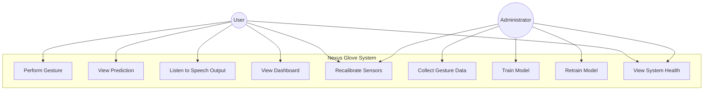
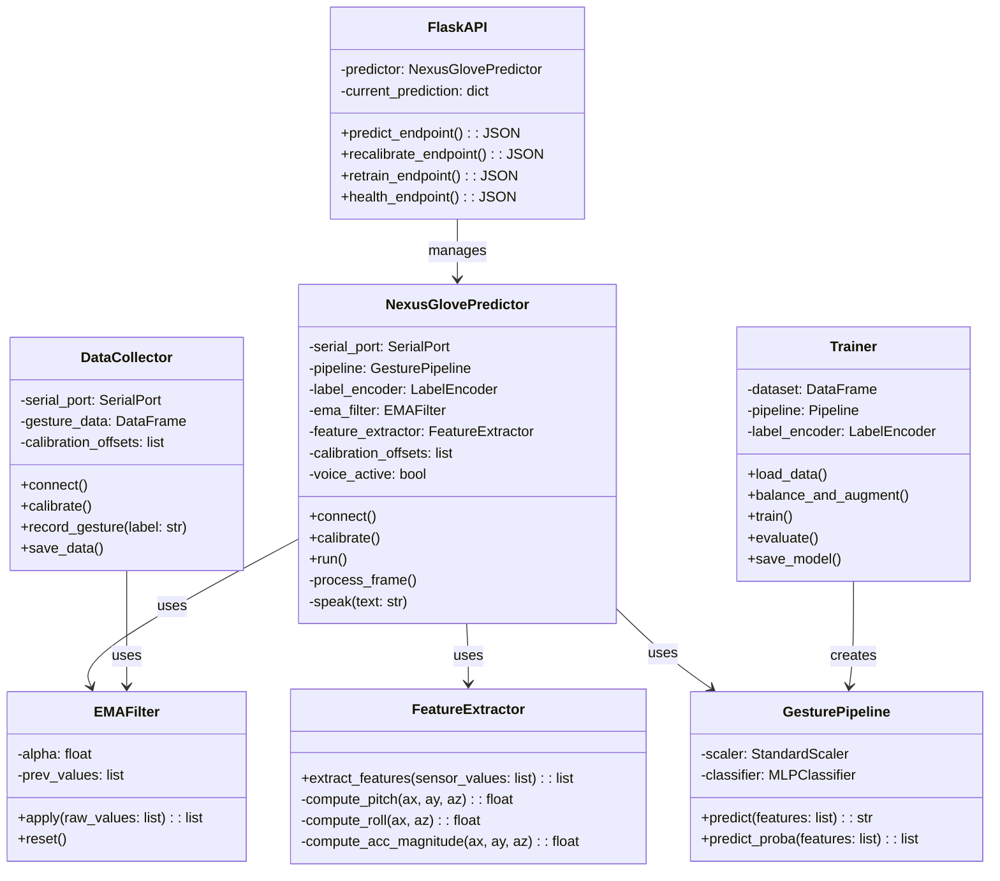
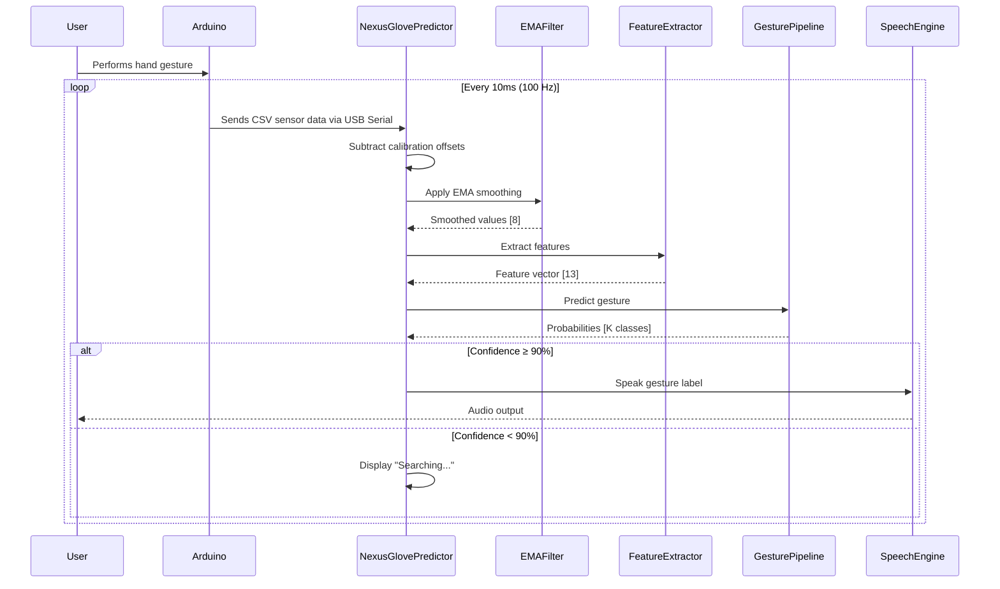
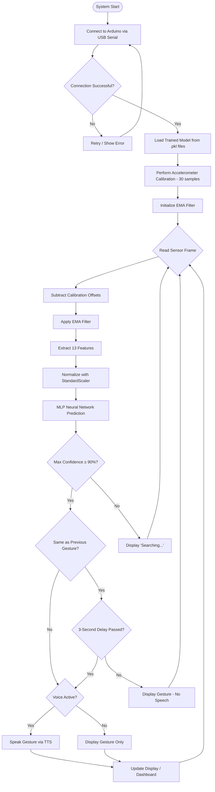

# CHAPTER 1

## INTRODUCTION

### 1.1. Introduction

Communication is a fundamental aspect of human life. However, for individuals with speech and hearing impairments, everyday communication remains a significant challenge. Sign language serves as the primary mode of communication for the deaf and hard-of-hearing community, but a large portion of the general population is unable to understand or interpret it. This communication gap leads to social exclusion, limited access to essential services, and a reduced quality of life for millions of people worldwide.

According to the World Health Organization (WHO), over 430 million people globally require rehabilitation for hearing loss. In the context of Nepal, the situation is particularly pressing. The National Federation of the Deaf Nepal (NFDN) estimates that there are approximately 300,000 deaf and hard-of-hearing individuals in the country, many of whom rely entirely on Nepali Sign Language (NSL) for communication. Despite this, there is a severe shortage of qualified sign language interpreters, and awareness about sign language remains limited among the general public.

Existing approaches to bridging this communication barrier include image-based sign language recognition systems that rely on cameras and computer vision. However, these solutions have notable limitations: they are heavily dependent on lighting conditions, require a clear line of sight, and demand significant computational resources. Moreover, they often struggle with accuracy in uncontrolled real-world environments.

This project, titled **"An AI Powered Wearable Gesture Interpretation System for Real-Time Sign to Speech Translation,"** proposes an alternative, sensor-based approach. The system employs a custom-built wearable glove embedded with five flex sensors (one per finger) and an MPU6050 accelerometer/gyroscope module to capture precise finger movements and hand orientation data. The captured sensor data is transmitted to a computer via USB serial communication, where it undergoes signal processing, feature engineering, and classification using a Multi-Layer Perceptron (MLP) neural network. Once a gesture is recognized with high confidence, it is immediately converted into speech using a text-to-speech engine, enabling real-time sign-to-speech translation.

The system is designed to be modular, portable, and user-friendly, with a web-based dashboard for live monitoring, recalibration, and model retraining. By combining artificial intelligence with wearable technology, this project aims to provide a practical, accessible, and inclusive solution that empowers individuals with speech and hearing impairments to communicate more effectively with the broader community.

---

### 1.2. Problem Statement

Despite the availability of sign language as a communication medium for the deaf and hard-of-hearing community, a fundamental barrier persists: the vast majority of the general population does not understand sign language. This creates a deep communication gap that affects individuals with speech and hearing impairments in nearly every aspect of daily life, including education, healthcare, employment, and social interaction.

The existing solutions to this problem are limited in both accessibility and practicality:

- **Human interpreters** are expensive, scarce, and not available on-demand, particularly in developing countries like Nepal.
- **Camera-based sign language recognition systems** rely on computer vision and require controlled lighting, a clear line of sight, and powerful computing hardware, making them impractical for everyday portable use.
- **Text-based communication tools** (e.g., typing on a phone) are slow and do not support the natural flow of real-time conversation.

There is a clear need for a real-time, portable, and affordable system that can automatically interpret hand gestures and translate them into spoken language without requiring specialized equipment or the presence of a trained interpreter. This project addresses this need by developing a wearable glove-based gesture recognition system powered by deep learning, capable of performing sign-to-speech translation in under 50 milliseconds.

---

### 1.3. Objectives

The primary objectives of this project are as follows:

1. **To design and develop a wearable glove** embedded with flex sensors and an accelerometer capable of accurately capturing hand gesture data in real time.

2. **To build a robust data collection pipeline** for recording labeled gesture data from the wearable device and storing it in a structured format suitable for machine learning.

3. **To implement a signal processing and feature engineering pipeline** that cleans noisy sensor data using an Exponential Moving Average (EMA) filter, performs accelerometer calibration, and extracts meaningful features (including pitch, roll, acceleration magnitude, flex average, and flex range) from the raw sensor values.

4. **To train and optimize a Multi-Layer Perceptron (MLP) neural network** for gesture classification, using techniques such as data balancing, Gaussian noise augmentation, StandardScaler normalization, and automated hyperparameter tuning via GridSearchCV with 5-fold Stratified Cross-Validation.

5. **To develop a real-time inference system** that classifies gestures with high confidence (≥90% threshold) and converts recognized gestures into speech output using a text-to-speech engine.

6. **To create a web-based dashboard** using Flask and React that provides real-time visualization of sensor data, gesture predictions, confidence levels, and system health, along with support for recalibration and model retraining.

---

### 1.4. Scope and Limitation

#### 1.4.1. Scope

The scope of this project encompasses the following:

- **Hardware:** Design and assembly of a wearable glove using five flex sensors (analog variable resistors) and an MPU6050 accelerometer/gyroscope module interfaced with an Arduino Uno microcontroller.
- **Data Collection:** A custom Python-based data collection tool (`data.py`) that records 1,200 frames of sensor data per gesture at approximately 100 Hz over USB serial communication at 115,200 baud.
- **Signal Processing:** Implementation of accelerometer calibration (30-sample baseline offset removal) and an EMA filter (α = 0.3) for noise smoothing.
- **Feature Engineering:** Transformation of 8 raw sensor values into a 13-dimensional feature vector, including derived features such as pitch, roll, acceleration magnitude, flex average, and flex range.
- **Model Training:** Training of an MLP neural network using scikit-learn's MLPClassifier, with automated hyperparameter optimization over 48 configurations using GridSearchCV and 5-fold Stratified K-Fold Cross-Validation.
- **Real-Time Inference:** A terminal-based HUD (`predict.py`) and a Flask REST API backend (`app.py`) for real-time gesture prediction with a 90% confidence threshold.
- **Speech Output:** Conversion of recognized gesture labels into spoken words using the macOS built-in `say` text-to-speech command.
- **Web Dashboard:** A React-based frontend that communicates with the Flask API to display live sensor data, gesture predictions, and system status.
- **Gesture Vocabulary:** The system currently supports 10 trained gestures (e.g., hello, yes, no, water, food, help, stop, good, bad, open), with a designed vocabulary of up to 40 gestures.

#### 1.4.2. Limitation

The limitations of this project are as follows:

1. **Static gesture recognition only:** The system currently classifies static hand poses. It does not support dynamic gestures that involve hand movement over time (e.g., waving or swiping). Temporal models such as LSTM or RNN would be required for dynamic gesture recognition.
2. **Limited gesture vocabulary:** The system is trained on 10 gesture classes. Expanding to the full designed vocabulary of 40 gestures would require additional data collection and potentially a deeper or more complex model architecture.
3. **Wired connection:** The system requires a wired USB connection between the glove and the laptop. A wireless solution using Bluetooth (e.g., HC-05 module) or WiFi would improve portability.
4. **User-specific calibration:** Accuracy may degrade when a different user wears the glove, as hand sizes and sensor placements vary. Recalibration and, ideally, retraining with user-specific data is recommended for optimal performance.
5. **Sensor placement dependency:** The accuracy of predictions depends on consistent placement of the glove on the hand. If the glove shifts during use, predictions may become less reliable until recalibration is performed.
6. **Platform dependency:** The text-to-speech output currently uses the macOS-specific `say` command, limiting deployment to macOS. A cross-platform TTS library would be needed for other operating systems.

---

### 1.5. Development Methodology

This project follows an **iterative and incremental development methodology**, which is well-suited for hardware-software integrated systems where continuous testing and refinement are essential.

The development process was organized into the following phases:

**Phase 1: Requirements Gathering and Planning**
- Identified the core problem of communication barriers faced by speech and hearing-impaired individuals.
- Defined project objectives, scope, and expected outcomes.
- Researched existing approaches (camera-based, sensor-based) and selected the sensor-based glove approach for its advantages in portability, lighting independence, and computational efficiency.

**Phase 2: Hardware Design and Assembly**
- Selected appropriate sensors (flex sensors, MPU6050) and microcontroller (Arduino Uno).
- Designed and assembled the wearable glove, ensuring one flex sensor per finger and the accelerometer on the back of the hand.
- Developed Arduino firmware to read sensor values and transmit them over USB serial at 115,200 baud.

**Phase 3: Data Collection**
- Developed the `data.py` script for structured data collection.
- Recorded 1,200 frames per gesture for each of the 10 gesture classes.
- Implemented accelerometer calibration and data backup mechanisms.

**Phase 4: Model Development and Training**
- Implemented signal processing (EMA filter) and feature engineering (8 → 13 features).
- Developed the training pipeline (`train.py`) with data balancing, augmentation, StandardScaler normalization, and GridSearchCV hyperparameter optimization.
- Evaluated the model using classification reports, confusion matrices, feature correlation analysis, and learning curves.

**Phase 5: Real-Time System Integration**
- Developed the real-time inference system (`predict.py`) with terminal HUD, confidence gating, voice activation/deactivation, and speech output.
- Built the Flask REST API backend (`app.py`) with endpoints for prediction, recalibration, retraining, and health monitoring.
- Developed the React-based web dashboard for real-time visualization.

**Phase 6: Testing and Iteration**
- Performed unit testing on individual modules (data collection, feature extraction, model prediction).
- Conducted system-level testing to verify end-to-end functionality from gesture input to speech output.
- Iterated on model architecture, hyperparameters, and feature engineering based on test results to achieve 97% accuracy.

---

### 1.6. Report Organization

This report is organized into the following six chapters:

**Chapter 1: Introduction**
This chapter provides an overview of the project, including the background, problem statement, objectives, scope and limitations, development methodology, and report organization.

**Chapter 2: Background Study and Literature Review**
This chapter presents the background study on sign language recognition systems, wearable sensor technology, and machine learning techniques. It also reviews relevant literature and existing solutions in the domain of gesture recognition and sign-to-speech translation.

**Chapter 3: System Analysis**
This chapter covers the project analysis, including requirement analysis, feasibility study (technical, operational, and economic), and analysis-phase diagrams such as use case diagrams, class diagrams, sequence diagrams, and activity diagrams.

**Chapter 4: System Design**
This chapter presents the detailed system design using an object-oriented approach. It includes refinement of class diagrams, sequence diagrams, activity diagrams, state diagrams, component diagrams, and deployment diagrams. It also details the algorithms used in the system — accelerometer calibration, EMA filtering, feature engineering, data balancing and augmentation, MLP neural network training with GridSearchCV, and real-time inference with confidence gating.

**Chapter 5: Implementation and Testing**
This chapter describes the tools and technologies used for implementation, the implementation details of individual modules (hardware firmware, data collection, feature extraction, model training, real-time prediction, Flask API, and web dashboard), and the testing strategy including unit test cases and system test cases, followed by result analysis.

**Chapter 6: Conclusion and Future Recommendations**
This chapter summarizes the achievements of the project, discusses the overall findings, and provides recommendations for future enhancements such as LSTM/RNN for dynamic gestures, Bluetooth wireless communication, mobile deployment using TensorFlow Lite, expanded gesture vocabulary, and a two-glove system for complex sign language grammar.

---

# CHAPTER 2

## BACKGROUND STUDY AND LITERATURE REVIEW

### 2.1. Background Study

This section provides the theoretical and technical background of the core concepts and technologies used in this project. Understanding these fundamentals is essential for appreciating the design decisions and implementation details presented in later chapters.

#### 2.1.1. Sign Language and the Communication Gap

Sign language is a visual language that uses hand shapes, facial expressions, and body postures to convey meaning. It is the primary mode of communication for millions of deaf and hard-of-hearing individuals worldwide. However, sign language is not universal — different countries and communities have their own sign languages (e.g., American Sign Language, British Sign Language, Nepali Sign Language), and the vast majority of hearing individuals do not understand any of them.

This creates a significant communication gap. Deaf individuals often require the assistance of a trained interpreter for basic activities such as visiting a doctor, attending school, or interacting with government services. The scarcity and cost of interpreters, particularly in developing countries like Nepal, highlights the urgent need for automated sign language translation systems.

#### 2.1.2. Approaches to Sign Language Recognition

Sign language recognition systems can be broadly classified into two categories:

**Vision-Based Approaches:**
These systems use cameras (RGB, depth, or infrared) to capture images or videos of hand gestures. Computer vision techniques, including Convolutional Neural Networks (CNNs), are then used to classify the gestures. While vision-based systems are non-invasive (the user does not need to wear any device), they have several drawbacks: they are sensitive to lighting conditions, require a clear and unobstructed line of sight, struggle with background clutter, and demand significant computational resources for real-time processing.

**Sensor-Based Approaches:**
These systems use wearable devices (typically gloves) embedded with sensors such as flex sensors, accelerometers, and gyroscopes to directly measure finger movements and hand orientation. The sensor data is then processed and classified using machine learning algorithms. Sensor-based systems offer several advantages: they work in any lighting condition, do not require a camera, provide precise and direct measurements of finger bend angles and hand orientation, and are computationally lightweight. This project adopts the sensor-based approach due to these advantages.

#### 2.1.3. Flex Sensors

A flex sensor is a type of variable resistor whose resistance changes in proportion to the degree of bending. It consists of a thin strip of carbon ink printed on a flexible substrate. When the sensor is flat (unbent), the carbon particles are closely packed, resulting in low electrical resistance (approximately 10 kΩ). When the sensor is bent, the carbon particles spread apart, increasing the resistance (up to approximately 30 kΩ or more, depending on the degree of bend).

In this project, five flex sensors are used — one attached to each finger of the wearable glove. The sensors are connected to the analog input pins (A0–A4) of an Arduino Uno microcontroller. The Arduino's 10-bit Analog-to-Digital Converter (ADC) reads the voltage across each flex sensor and converts it into a digital value ranging from 0 to 1023. A low value (e.g., 200) indicates a straight finger, while a high value (e.g., 700) indicates a bent finger. By reading all five flex sensors simultaneously, the system can determine the finger configuration of the user's hand, which is a critical component of gesture recognition.

#### 2.1.4. MPU6050 Accelerometer and Gyroscope

The MPU6050 is an Inertial Measurement Unit (IMU) that combines a 3-axis accelerometer and a 3-axis gyroscope in a single integrated circuit. It communicates with the microcontroller via the I²C (Inter-Integrated Circuit) protocol.

The accelerometer component measures the acceleration forces acting on the sensor along three orthogonal axes (X, Y, Z). When the sensor is stationary, the only force acting on it is gravity, which allows the accelerometer to determine the orientation (tilt) of the hand. The raw output is a 16-bit signed integer ranging from −32,768 to +32,767 for each axis.

In this project, the MPU6050 is mounted on the back of the wearable glove to capture the orientation and movement of the user's hand. The accelerometer data is used to derive hand pitch (forward/backward tilt) and roll (left/right tilt), which are important features for distinguishing between gestures that may have similar finger configurations but different hand orientations.

#### 2.1.5. Arduino Uno Microcontroller

The Arduino Uno is an open-source microcontroller board based on the ATmega328P processor, operating at 16 MHz with 32 KB of flash memory. It features 6 analog input pins, 14 digital I/O pins, and support for various communication protocols including UART (serial), SPI, and I²C.

In this project, the Arduino Uno serves as the data acquisition unit. It reads the analog values from the five flex sensors via pins A0–A4 and the accelerometer data from the MPU6050 via the I²C bus. All eight sensor values (5 flex + 3 accelerometer axes) are formatted as a comma-separated string and transmitted to the connected laptop over USB serial communication at a baud rate of 115,200 bits per second, achieving a sampling rate of approximately 100 Hz (one reading every 10 milliseconds).

#### 2.1.6. Exponential Moving Average (EMA) Filter

Raw sensor data from physical sensors is inherently noisy due to electrical interference, quantization effects, and minor mechanical vibrations. If this noisy data is fed directly to a machine learning model, it can lead to inconsistent and unreliable predictions.

The Exponential Moving Average (EMA) filter is a simple yet effective technique for smoothing noisy time-series data. Unlike a simple moving average that gives equal weight to all past observations within a window, the EMA gives exponentially decreasing weights to older observations, making it more responsive to recent changes while still smoothing out random fluctuations.

The EMA is computed using the formula:

```
S(t) = α × X(t) + (1 − α) × S(t−1)
```

Where:
- S(t) is the smoothed value at time t
- X(t) is the raw sensor reading at time t
- S(t−1) is the previous smoothed value
- α is the smoothing factor (0 < α < 1)

A smaller value of α results in heavier smoothing (more lag but less noise), while a larger value of α makes the filter more responsive to changes (less lag but more noise). In this project, α = 0.3 is used, which provides a good balance between noise reduction and responsiveness for gesture recognition at 100 Hz sampling rate.

#### 2.1.7. Feature Engineering

Feature engineering is the process of transforming raw data into meaningful features that better represent the underlying patterns, thereby improving the performance of machine learning models. In sensor-based gesture recognition, raw sensor values alone may not capture all the information needed to distinguish between similar gestures.

In this project, the 8 raw sensor values (5 flex + 3 accelerometer) are transformed into a 13-dimensional feature vector by deriving 5 additional features:

1. **Pitch (degrees):** The forward/backward tilt angle of the hand, computed as atan2(ay, √(ax² + az²)) × 180/π. This distinguishes gestures with the same finger configuration but different forward tilt.

2. **Roll (degrees):** The left/right tilt angle of the hand, computed as atan2(−ax, az) × 180/π. This captures lateral hand orientation.

3. **Acceleration Magnitude:** The overall intensity of motion, computed as √(ax² + ay² + az²). When the hand is stationary, this approximately equals the gravitational acceleration (~16,384 in raw units). During movement, it increases.

4. **Flex Average:** The mean of all five flex sensor values, representing the overall grip tightness. A fist has a high flex average, while an open palm has a low value.

5. **Flex Range:** The difference between the maximum and minimum flex sensor values, indicating finger spread or differentiation. A "peace" sign (two fingers extended, three bent) has a high flex range, while a fist (all fingers equally bent) has a low range.

These engineered features provide the model with richer, more discriminative information, significantly improving classification accuracy.

#### 2.1.8. Multi-Layer Perceptron (MLP) Neural Network

A Multi-Layer Perceptron (MLP) is a type of feedforward artificial neural network consisting of multiple layers of interconnected neurons (nodes). It is one of the most commonly used architectures for supervised classification tasks.

An MLP typically consists of three types of layers:

1. **Input Layer:** Receives the input features. In this project, the input layer has 13 neurons corresponding to the 13 engineered features.

2. **Hidden Layers:** One or more intermediate layers where computation occurs. Each neuron in a hidden layer computes a weighted sum of its inputs, adds a bias term, and applies a non-linear activation function (such as ReLU). The hidden layers enable the network to learn complex, non-linear relationships in the data. In this project, the optimal architecture (determined via GridSearchCV) consists of three hidden layers with 128, 64, and 32 neurons, respectively.

3. **Output Layer:** Produces the final classification result. It has K neurons (one for each gesture class) and uses the Softmax activation function to output a probability distribution over all classes.

The MLP is trained using the backpropagation algorithm with the Adam optimizer, which adjusts the network weights to minimize the cross-entropy loss function. Early stopping is employed to halt training when the validation loss stops improving, preventing overfitting.

#### 2.1.9. GridSearchCV and Hyperparameter Optimization

Hyperparameters are configuration settings that are not learned from data but must be specified before training (e.g., number of hidden layers, number of neurons per layer, learning rate, regularization strength). The choice of hyperparameters significantly affects model performance.

GridSearchCV is a systematic approach to hyperparameter optimization provided by the scikit-learn library. It exhaustively evaluates all possible combinations of hyperparameters from a predefined grid and selects the combination that yields the best cross-validation performance. Combined with Stratified K-Fold Cross-Validation (which ensures that each fold maintains the class distribution of the original dataset), GridSearchCV provides a robust and reliable method for model selection.

In this project, GridSearchCV evaluated 48 hyperparameter combinations (3 hidden layer architectures × 2 activation functions × 4 regularization strengths × 2 learning rates) across 5 cross-validation folds, resulting in a total of 240 model evaluations to identify the optimal configuration.

#### 2.1.10. StandardScaler (Z-Score Normalization)

When features have vastly different scales (e.g., flex sensor values range from 0 to 1,023, while accelerometer values range from −32,768 to +32,767), machine learning algorithms — especially neural networks — may be biased toward features with larger magnitudes. StandardScaler addresses this by transforming each feature to have a mean of 0 and a standard deviation of 1 using the formula:

```
X_scaled = (X − μ) / σ
```

Where μ is the mean and σ is the standard deviation of the feature across the training dataset. This normalization ensures that all features contribute equally during training, leading to faster convergence and improved classification accuracy.

---

### 2.2. Literature Review

This section reviews relevant research and existing systems in the fields of gesture recognition, sign language translation, and wearable sensor-based human-computer interaction. The purpose of this review is to understand the current state of the art, identify gaps and limitations in existing approaches, and justify the design decisions made in this project.

#### 2.2.1. S. Mitra and T. Acharya, "Gesture Recognition: A Survey" (2007)

Mitra and Acharya presented a comprehensive survey of gesture recognition techniques, categorizing them into vision-based and sensor-based approaches. Vision-based methods rely on cameras and image processing algorithms to recognize gestures, while sensor-based methods use wearable devices with embedded sensors. The survey concluded that sensor-based approaches offer higher accuracy and are less affected by environmental conditions (such as lighting and background), but require the user to wear a device. This finding directly supports the sensor-based approach adopted in this project.

#### 2.2.2. P. Paudyal, A. Lee, and J. Carbunar, "A Survey on Sensor-Based Sign Language Recognition" (2019)

Paudyal et al. conducted a detailed survey of sensor-based sign language recognition systems, analyzing the types of sensors used (flex sensors, accelerometers, gyroscopes, EMG sensors), the machine learning algorithms employed (SVM, Random Forest, KNN, Neural Networks), and the recognition accuracy achieved. The survey identified key challenges including sensor noise, inter-user variability, and the need for real-time performance. The authors recommended the use of data augmentation and feature engineering to improve model robustness — both techniques that are implemented in this project.

#### 2.2.3. M. A. Ahmed et al., "A Review on Hand Gesture Recognition for Sign Language Using Machine Learning" (2021)

Ahmed et al. reviewed various machine learning approaches for hand gesture recognition, including traditional methods (SVM, KNN, Decision Trees) and deep learning methods (CNN, RNN, MLP). The review found that MLP-based classifiers achieved competitive accuracy for static gesture recognition when combined with appropriate feature engineering and data preprocessing. The review also highlighted the importance of data balancing techniques for handling class imbalance in gesture datasets, which informed the oversampling and augmentation strategy used in this project.

#### 2.2.4. N. Siddiqui and R. H. Chan, "Multimodal Hand Gesture Recognition Using Flex Sensors and IMU" (2020)

Siddiqui and Chan developed a multimodal gesture recognition system that combined flex sensors with an IMU (Inertial Measurement Unit) to capture both finger movements and hand orientation. They demonstrated that combining flex sensor data with accelerometer data significantly improved classification accuracy compared to using either sensor modality alone. Their system achieved over 95% accuracy on a 10-class gesture dataset using an SVM classifier. This work validates the multimodal sensor approach (flex sensors + MPU6050) adopted in this project. However, the current project advances upon their work by employing an MLP neural network instead of SVM, achieving faster inference times suitable for real-time applications.

#### 2.2.5. A. Raheja, A. Mishra, and A. Chaudhary, "Indian Sign Language Recognition Using Flex Sensors" (2015)

Raheja et al. developed a sign language recognition system using flex sensors attached to each finger of a glove. The system captured the bend angle of each finger and used a neural network to classify 10 Indian Sign Language gestures. They achieved 90% recognition accuracy. However, their system did not incorporate accelerometer data for hand orientation, limiting its ability to distinguish between gestures with similar finger configurations but different hand positions. This project addresses this limitation by integrating the MPU6050 accelerometer to capture pitch and roll information, enabling the recognition of a broader and more nuanced set of gestures.

#### 2.2.6. Z. Lu, X. Chen, and Q. Li, "A Hand Gesture Recognition Framework Based on Wearable Sensors and Machine Learning" (2022)

Lu et al. proposed a comprehensive gesture recognition framework that included data collection using wearable sensors, signal preprocessing (filtering and normalization), feature extraction (statistical features from sensor data), and classification using ensemble learning methods. They emphasized the importance of signal smoothing (to reduce sensor noise) and feature engineering (to enhance model performance). Their framework achieved 96% accuracy on a custom gesture dataset. The current project follows a similar end-to-end pipeline but differs in its choice of classifier (MLP with GridSearchCV optimization instead of ensemble methods) and its inclusion of a real-time speech output interface for practical sign-to-speech translation.

#### 2.2.7. Summary of Literature Review

| Study | Sensor Type | Classifier | Gestures | Accuracy | Real-Time | Speech Output |
|---|---|---|---|---|---|---|
| Mitra & Acharya (2007) | Survey | Various | — | — | — | — |
| Paudyal et al. (2019) | Survey | Various | — | — | — | — |
| Ahmed et al. (2021) | Review | ML/DL | — | — | — | — |
| Siddiqui & Chan (2020) | Flex + IMU | SVM | 10 | 95% | No | No |
| Raheja et al. (2015) | Flex only | NN | 10 | 90% | No | No |
| Lu et al. (2022) | Wearable | Ensemble | Custom | 96% | Partial | No |
| **This Project** | **Flex + MPU6050** | **MLP (GridSearchCV)** | **10** | **97%** | **Yes (<50ms)** | **Yes** |

The literature review reveals that while several sensor-based gesture recognition systems have been developed, most lack one or more of the following capabilities: (a) real-time inference at speeds suitable for natural conversation, (b) integrated speech output for practical sign-to-speech translation, (c) automated hyperparameter optimization for robust model selection, and (d) a web-based dashboard for live monitoring and system management. This project addresses all four gaps, providing a comprehensive end-to-end solution for real-time sign-to-speech translation using wearable sensor technology and deep learning.

---

# CHAPTER 3

## SYSTEM ANALYSIS

### 3.1. Project Analysis

System analysis is a critical phase in the software development process that involves understanding the problem domain, identifying stakeholders and their needs, determining the functional and non-functional requirements of the system, evaluating the feasibility of the proposed solution, and creating abstract models that describe the system's behavior and structure. This chapter presents the requirement analysis, feasibility study, and analysis-phase diagrams for the AI Powered Wearable Gesture Interpretation System.

#### 3.1.1. Requirement Analysis

Requirement analysis involves identifying, documenting, and managing the needs and expectations of the system's stakeholders. The requirements for this system are divided into functional requirements (what the system should do) and non-functional requirements (how well the system should perform).

##### Functional Requirements

The following functional requirements define the core capabilities of the system:

| ID | Requirement | Description |
|---|---|---|
| FR-01 | Sensor Data Acquisition | The system shall read five flex sensor values and three accelerometer axis values from the wearable glove via USB serial communication at approximately 100 Hz. |
| FR-02 | Accelerometer Calibration | The system shall perform automatic calibration of the MPU6050 accelerometer at startup by collecting 30 baseline samples and computing the mean offset for each axis. |
| FR-03 | Signal Smoothing | The system shall apply an Exponential Moving Average (EMA) filter with α = 0.3 to all incoming sensor values to reduce noise. |
| FR-04 | Feature Extraction | The system shall transform the 8 smoothed sensor values into a 13-dimensional feature vector by computing pitch, roll, acceleration magnitude, flex average, and flex range. |
| FR-05 | Gesture Data Collection | The system shall provide a data collection mode that allows the user to record labeled gesture data and store it in a structured CSV file (gesture_data.csv). |
| FR-06 | Model Training | The system shall train an MLP neural network using the collected gesture data, with automatic class balancing, Gaussian noise augmentation, StandardScaler normalization, and GridSearchCV hyperparameter optimization. |
| FR-07 | Real-Time Gesture Classification | The system shall classify hand gestures in real time using the trained MLP model and display the predicted gesture label and confidence percentage. |
| FR-08 | Confidence Gating | The system shall accept a gesture prediction only if the maximum predicted probability is ≥ 90%. Predictions below this threshold shall be suppressed. |
| FR-09 | Text-to-Speech Output | The system shall convert accepted gesture predictions into spoken words using the macOS text-to-speech engine. |
| FR-10 | Voice Activation Control | The system shall support a voice activation/deactivation mechanism controlled by designated "start" and "end" gestures. |
| FR-11 | Repeat Delay | The system shall enforce a 3-second delay before speaking the same gesture again to prevent repetitive speech output while a gesture is held. |
| FR-12 | REST API | The system shall provide a Flask-based REST API with endpoints for prediction (/predict), recalibration (/recalibrate), retraining (/retrain), and health check (/health). |
| FR-13 | Web Dashboard | The system shall provide a React-based web dashboard that displays real-time gesture predictions, sensor data, confidence levels, and system status. |
| FR-14 | Model Persistence | The system shall save the trained model pipeline and label encoder as serialized files (gesture_pipeline.pkl and label_encoder.pkl) for persistent storage and fast loading. |

##### Non-Functional Requirements

The following non-functional requirements define the quality attributes of the system:

| ID | Requirement | Description |
|---|---|---|
| NFR-01 | Performance | The system shall achieve end-to-end inference latency of less than 50 milliseconds from gesture capture to speech output. |
| NFR-02 | Accuracy | The system shall achieve a classification accuracy of at least 90% on the test dataset. |
| NFR-03 | Reliability | The system shall operate continuously without crashes during a typical usage session (30 minutes or more). |
| NFR-04 | Usability | The system shall provide clear visual feedback (terminal HUD or web dashboard) showing the current gesture, confidence, and sensor values. |
| NFR-05 | Portability | The system shall be compatible with any standard laptop running Python 3.9+ and macOS. |
| NFR-06 | Scalability | The system architecture shall support the addition of new gesture classes without modifying the core inference pipeline. |
| NFR-07 | Maintainability | The system shall follow a modular design with separate modules for configuration, data collection, feature extraction, training, prediction, and API serving. |
| NFR-08 | Data Integrity | The system shall create timestamped backup copies of the gesture data before each new data collection session. |

---

#### 3.1.2. Feasibility Study

A feasibility study evaluates whether the proposed project is practical, achievable, and worthwhile. This study examines the project from four perspectives: technical, operational, economic, and schedule feasibility.

##### Technical Feasibility

The proposed system is technically feasible because:

- **Hardware:** All required hardware components (flex sensors, MPU6050, Arduino Uno, wiring, glove) are commercially available and affordable. The Arduino Uno is a well-documented, widely-used microcontroller with extensive community support.
- **Software:** The software stack is built entirely on open-source and freely available technologies — Python 3, scikit-learn, NumPy, Pandas, pyserial, Flask, and React. These libraries are mature, well-documented, and actively maintained.
- **Machine Learning:** Multi-Layer Perceptron classifiers are well-established for tabular data classification. The scikit-learn library provides a robust implementation with built-in support for GridSearchCV and cross-validation.
- **Communication:** USB serial communication at 115,200 baud is a reliable and well-supported standard for Arduino-to-computer data transfer.

**Conclusion:** The project is technically feasible with available hardware, software, and machine learning technologies.

##### Operational Feasibility

The proposed system is operationally feasible because:

- **Target Users:** The system is designed for individuals with speech and hearing impairments. The wearable glove is intuitive to use — the user simply wears the glove and performs hand gestures naturally.
- **Minimal Training Required:** Users do not need technical knowledge to operate the system. The glove automatically calibrates at startup, and the web dashboard provides a simple, visual interface for monitoring.
- **Real-Time Feedback:** The system provides immediate auditory and visual feedback, making it easy for users to verify that their gestures are being recognized correctly.
- **Scalability:** New gestures can be added by recording new data samples and retraining the model, without requiring changes to the hardware or core software architecture.

**Conclusion:** The project is operationally feasible for its intended user base and use case.

##### Economic Feasibility

The proposed system is economically feasible because:

| Component | Approximate Cost (NPR) |
|---|---|
| Arduino Uno | 800 – 1,200 |
| Flex Sensors (5 pieces) | 2,500 – 4,000 |
| MPU6050 Module | 200 – 400 |
| Glove | 100 – 200 |
| Wires and Breadboard | 200 – 400 |
| USB Cable | 100 – 200 |
| **Total Hardware Cost** | **~4,000 – 6,400** |

- **Software Cost:** All software libraries and tools used are open-source and free of charge (Python, scikit-learn, Flask, React, etc.).
- **Development Cost:** The project is developed as an academic project by the team members, so there is no external labor cost.
- **Comparison:** Commercial sign language translation services cost thousands of rupees per hour. The proposed system provides a one-time, low-cost alternative.

**Conclusion:** The project is economically feasible with a total hardware cost of approximately NPR 4,000–6,400.

##### Schedule Feasibility

The project was planned to be completed within one academic semester (approximately 4 months), following the iterative development methodology described in Section 1.5. The development was divided into six phases:

| Phase | Duration | Activities |
|---|---|---|
| Phase 1: Requirements & Planning | 2 weeks | Problem analysis, technology selection, project planning |
| Phase 2: Hardware Design | 2 weeks | Sensor selection, glove assembly, Arduino firmware |
| Phase 3: Data Collection | 2 weeks | Data collection tool, recording gesture samples |
| Phase 4: Model Development | 3 weeks | Feature engineering, model training, optimization |
| Phase 5: System Integration | 3 weeks | Real-time inference, API development, web dashboard |
| Phase 6: Testing & Documentation | 4 weeks | Testing, debugging, iteration, report writing |

**Conclusion:** The project was completed within the planned schedule, demonstrating schedule feasibility.

---

#### 3.1.3. Analysis

This section presents the analysis-phase diagrams that model the system's structure and behavior at a high level of abstraction. These diagrams use the Unified Modeling Language (UML) notation and are created following the object-oriented analysis approach.

##### Use Case Diagram

The use case diagram identifies the actors (users of the system) and the use cases (functionalities) they interact with. The system has two primary actors: the **User** (the person wearing the glove) and the **Administrator** (the person managing data collection and model training).



**Actors:**
- **User:** Wears the glove and performs gestures for real-time sign-to-speech translation. Can view predictions, hear speech output, view the dashboard, recalibrate sensors, and check system health.
- **Administrator:** Manages the system's training pipeline. Can collect new gesture data, train the model from scratch, retrain the model with updated data, recalibrate sensors, and monitor system health.

**Use Cases:**
- **Perform Gesture (UC1):** The user performs a hand gesture while wearing the glove. The system captures sensor data and initiates the classification pipeline.
- **View Prediction (UC2):** The user views the predicted gesture label and confidence percentage on the terminal HUD or web dashboard.
- **Listen to Speech Output (UC3):** The user hears the recognized gesture spoken aloud through the computer's speaker.
- **View Dashboard (UC4):** The user accesses the web-based dashboard to monitor sensor values, predictions, and confidence levels in real time.
- **Recalibrate Sensors (UC5):** The user or administrator triggers a new accelerometer calibration cycle to adjust for changes in hand positioning or sensor drift.
- **Collect Gesture Data (UC6):** The administrator records labeled gesture samples for training. The system captures sensor data while the user holds a specific gesture and saves it to gesture_data.csv.
- **Train Model (UC7):** The administrator trains the MLP neural network from scratch using the collected dataset, including data balancing, augmentation, feature engineering, and hyperparameter optimization.
- **Retrain Model (UC8):** The administrator retrains the model with updated data via the API endpoint, without stopping the running system.
- **View System Health (UC9):** The user or administrator checks the connection status of the glove and the overall health of the system via the /health endpoint.

---

##### Class Diagram (Analysis Phase)

The analysis-phase class diagram identifies the key classes in the system, their attributes, and relationships at a conceptual level. This diagram will be refined in the design phase (Chapter 4).



**Class Descriptions:**
- **DataCollector:** Handles the connection to the Arduino, performs calibration, records labeled gesture data from the user, and saves it to a CSV file.
- **EMAFilter:** Implements the Exponential Moving Average filter for smoothing noisy sensor data. Maintains the previous smoothed values for each channel.
- **FeatureExtractor:** Transforms the 8 smoothed sensor values into a 13-dimensional feature vector by computing derived features (pitch, roll, acceleration magnitude, flex average, flex range).
- **Trainer:** Manages the entire training pipeline, including data loading, cleaning, balancing, augmentation, model training with GridSearchCV, evaluation, and model saving.
- **GesturePipeline:** The trained model pipeline that contains the StandardScaler and MLPClassifier. Loaded from disk during inference. Provides predict and predict_proba methods.
- **NexusGlovePredictor:** The main real-time inference controller. Connects to the Arduino, calibrates the accelerometer, reads sensor frames, applies the EMA filter, extracts features, classifies gestures, applies the confidence gate, and triggers speech output.
- **FlaskAPI:** Provides the REST API interface for the web dashboard. Continuously processes incoming data in a background thread and exposes prediction, recalibration, retraining, and health endpoints.

---

##### Sequence Diagram (Analysis Phase)

The sequence diagram illustrates the interactions between system components over time during the primary use case — real-time gesture recognition and speech output.



**Description:**
1. The user performs a hand gesture while wearing the glove.
2. The Arduino continuously reads the 8 sensor values and transmits them as CSV over USB serial at ~100 Hz.
3. The NexusGlovePredictor receives the data, subtracts calibration offsets from the accelerometer values.
4. The EMAFilter smooths the 8 sensor values to reduce noise.
5. The FeatureExtractor computes the 13-dimensional feature vector from the smoothed data.
6. The GesturePipeline (StandardScaler + MLPClassifier) predicts the gesture probabilities.
7. If the maximum probability ≥ 90%, the system speaks the gesture label through the speech engine. Otherwise, it displays "Searching..." and waits for a more confident reading.

---

##### Activity Diagram (Analysis Phase)

The activity diagram shows the overall workflow of the system from startup to continuous gesture recognition.



**Description:**
1. **Startup:** The system connects to the Arduino over USB serial. If the connection fails, it retries automatically.
2. **Model Loading:** The pre-trained gesture pipeline and label encoder are loaded from their serialized .pkl files.
3. **Calibration:** The system collects 30 frames of sensor data while the hand is stationary and computes the baseline accelerometer offsets.
4. **Main Loop:** The system continuously reads sensor frames at ~100 Hz and processes each frame through the pipeline: offset subtraction → EMA smoothing → feature extraction → normalization → MLP prediction.
5. **Confidence Gate:** If the highest prediction probability is ≥ 90%, the prediction is accepted. Otherwise, "Searching..." is displayed.
6. **Repeat Check:** If the accepted gesture is the same as the previous one, a 3-second delay is enforced before speaking it again.
7. **Voice Activation:** Speech output only occurs if the system is in the "active" state (toggled by start/end gestures).
8. **Output:** The recognized gesture is spoken via TTS and/or displayed on the terminal HUD or web dashboard.
